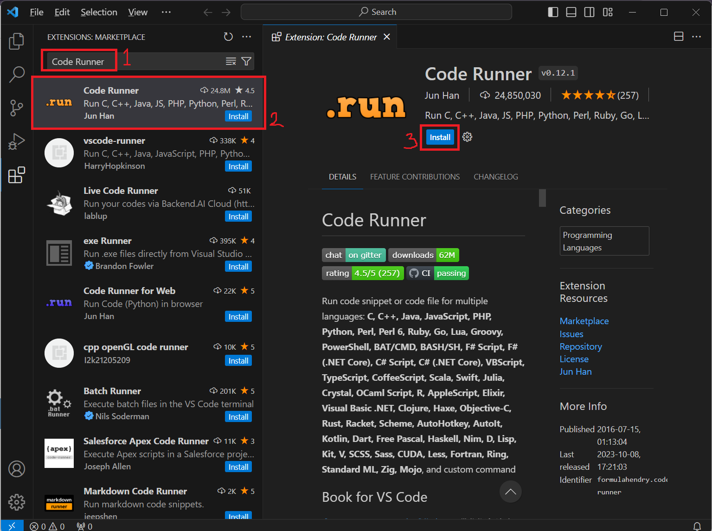
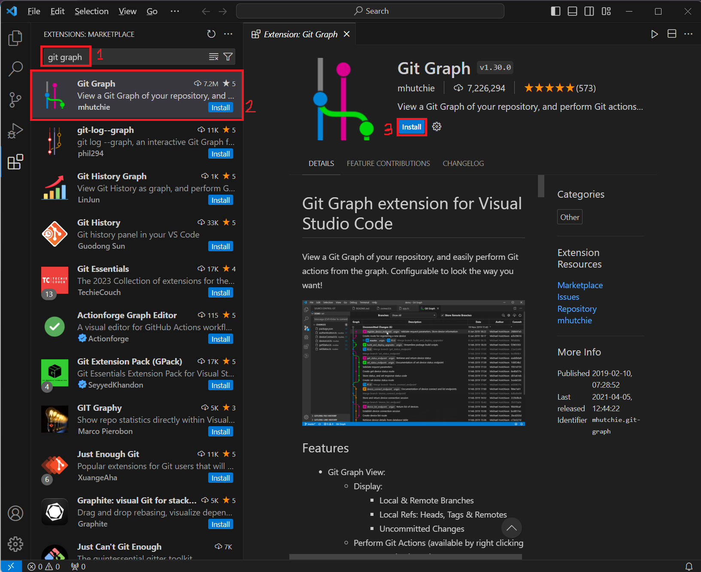

# 해달 0주차 과제 가이드

## 🧱 문제를 풀다가 막혔을 때

문제를 풀다보면 어디서부터 손을 대야할지, 무엇을 모르는 지 몰라서 검색을 못 할 때가 있습니다.

그럴 땐 얼마든지 **동아리방**이나 **디스코드**에서 편하게 질문하세요!

## 1. [Visual Studio Code](https://code.visualstudio.com/) 설치

### 1. Visual Studio Code 다운로드

1. `VSCode` 사이트에 접속해서 다운받습니다.
   자신의 운영체제에 맞는 옵션을 `Stable 버전`으로 다운로드 하면 됩니다.
   (Insiders 버전은 최신 버전이지만 불안정하여 여러 버그가 나타날 수 있습니다.
   Stable은 버그 발생률을 줄인 버전으로, Stable로 다운로드 해주시면 됩니다.)

   

### 2-A. Window에서 설치

1. 다운로드한 설치 파일을 더블클릭하여 실행시킵니다.

   

2. 약관에 동의하고, 다음 버튼을 클릭합니다.

   

3. 파일이 설치될 위치를 선택한 후 다음 버튼을 클릭합니다.

   

4. 시작 메뉴에 폴더를 만들거나 기존의 시작 메뉴 폴더를 선택합니다.
   선택하지 않는 경우 자동으로 Visual Studio Code폴더를 생성하여 프로그램 바로가기가 생성됩니다.

   

5. 필요한 추가 작업을 선택합니다.
   3, 4번은 기본으로 체크되어 있으니 체크를 풀지 마시고 다음 버튼을 클릭하는 것을 추천드립니다.

   

6. 설치 버튼을 클릭하여 완료합니다.

   

### 2-B. Mac에서 설치

1. 다운로드를 완료하면 (1)과 같은 파일이 보입니다.
   (1)을 더블 클릭 해주면 압축이 해제되며 (2)가 생성됩니다.

   

2. (2)를 더블클릭하면 아래와 같은 창이 뜨며 VS Code를 이용할 수 있습니다.

   

## 2. Extension 설치

Extension 이름과 제공자를 확인하고 설치하세요.

| 이름        | 제공자    |
| ----------- | --------- |
| Code Runner | Jun Han   |
| Git Graph   | mhutchie  |
| C/C++       | Microsoft |
| Python      | Microsoft |

### 1. Code Runner

1. `Extension` 탭에서 `Code Runner`를 설치합니다.

   

### 2. Git Graph

1. `Extension` 탭에서 `Git Graph`를 설치합니다.

   

### 3-A. (C 사용자) C/C++

1. `Extension` 탭에서 `C/C++`를 설치합니다.

   

### 3-B. (Python 사용자) Python

1. `Extension` 탭에서 `Python`을 설치합니다.

   

## 3. 기본 Terminal 설정 (git bash)

1. `ctrl + shift + p` 입력한 뒤, `terminal default`를 입력하면 아래와 같이 뜹니다.

   ```
   Terminal: Select Default Profile
   ```

   

1. `git bash`로 설정합니다.

   

## 4. Code Runner 설정

1. `Extension` 탭에서 Code Runner 우측 하단 톱니바퀴를 클릭 - `Extension Settings`을 클릭합니다.

   우측 설정창에서 `Run In Terminal`을 찾아 체크합니다.

   

1. 1번과 마찬가지로 `Terminal Root` 를 찾아 `/`를 입력합니다.

   
